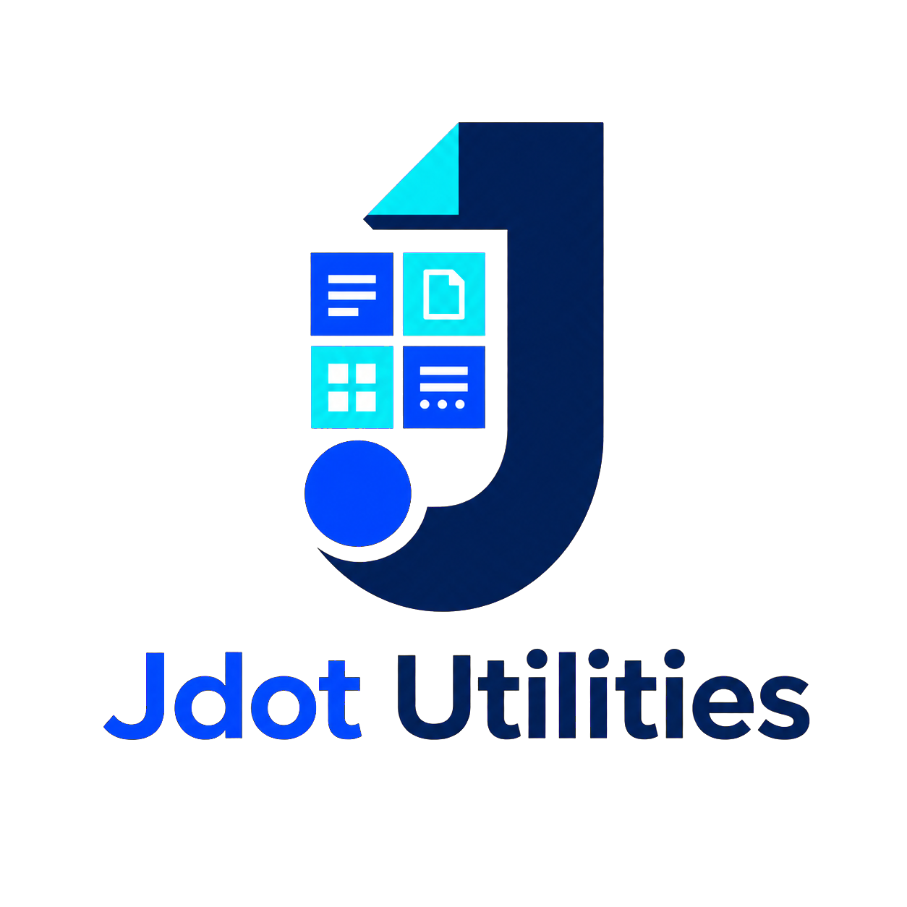

<div align="center">
  

  ### Local file utilities — conversion, PDF tools, and more.
  **No cloud. No account. No upload. Your files never leave your computer.**

  <sub>A single Windows app that bundles many file utilities behind one clean, offline interface.</sub>
</div>

---

## What is it?

**Jdot Utilities** is an offline desktop app (Windows `.exe`) for the everyday file
chores that usually send you to a sketchy upload-your-file website: converting
documents and images, and a full set of PDF tools. Everything runs **on your
machine** — there is no server, no account, and no network call at runtime.

It's built around a **tool registry**: every utility is one self-describing file,
and the interface builds itself from what those files declare. Adding a new
converter doesn't touch the UI.

> Inspired by the idea of all-in-one converters like
> [ConvertX](https://github.com/C4illin/ConvertX), but its own independent
> project — a native offline desktop app rather than a self-hosted web server.

---

## Highlights

- 🔒 **Fully offline & private.** No telemetry, no uploads, no accounts. Verifiable — there are no network calls in the code.
- 🏠 **Drop-and-go.** The Convert tab's **Home** landing auto-detects a dropped file's type and routes it to the right tool.
- 📄 **Real PDF toolkit** — merge, split, rotate, delete/extract pages, images↔PDF, PDF→images, PDF→text, **OCR**, and **compress / PDF-A**.
- 🔁 **Document conversion** — Markdown, HTML, Word (`.docx`), plain text, PDF — any-to-any.
- 🖼 **Image conversion** — PNG, JPG, WebP, AVIF, TIFF, GIF, plus HEIC/HEIF (iPhone photos), with resize and quality.
- 🧾 **Data conversion** — JSON, YAML, CSV, TSV, XML, any-to-any.
- 📊 **Office** (via installed LibreOffice) — Word, spreadsheet, and presentation families, each to PDF.
- 🧭 **All Tools tab** — every capability as a simple card: what it does and its formats, one click to open.
- ⚡ **Batch** — drop 100+ files, per-file progress, a concurrency limit, and cancel.
- 🎨 **Three themes** — Light, Grey, Black, with the brand-blue accent.

### Tools in the app today

| Tool | Category | Converts |
|------|----------|----------|
| Document Converter | Document | md · html · docx · txt → html · md · txt · pdf · docx |
| Image Converter | Image | png · jpg · webp · avif · tiff · gif · svg · heic · heif → png · jpg · webp · avif · tiff · gif |
| Data Converter | Data | json · yaml · csv · tsv · xml (any → any) |
| Word / Spreadsheets / Presentations | Office | docx·doc·odt·rtf / xlsx·xls·ods·csv / pptx·ppt·odp — each → pdf *(needs LibreOffice)* |
| Merge PDFs | PDF | many PDFs → one |
| Split PDF | PDF | one PDF → many (per-page / every-N / ranges) |
| Rotate / Delete / Extract pages | PDF | pdf → pdf |
| Images → PDF | PDF | images → one PDF |
| PDF → Images | PDF | pdf → png / jpg per page |
| PDF → Text | PDF | pdf → txt (text layer) |
| OCR → Text | PDF | scanned pdf / image → txt *(offline OCR)* |
| Compress / PDF-A | PDF | pdf → smaller pdf, or archival PDF/A *(needs Ghostscript)* |

👉 **Full capability list — current and planned — is in [FORMATS.md](FORMATS.md).**
Release notes are in [CHANGELOG.md](CHANGELOG.md).

---

## Install

**Users:** grab the latest `.exe` from the
[Releases](https://github.com/AxialForge/jdot-utilities/releases) page — either the
installer or the single-file portable build. No setup, no dependencies.

Two tools use an external engine (both auto-detected; path configurable in Settings):
- **Office** conversions need [LibreOffice](https://www.libreoffice.org/).
- **Compress / PDF-A** needs [Ghostscript](https://www.ghostscript.com/) (or a
  bundled copy — see below).

Everything else — including **OCR**, which ships its own English model — is
self-contained and works with no setup.

> **Note on unsigned builds:** releases aren't code-signed yet, so Windows
> SmartScreen may warn on first run ("More info → Run anyway"). Signing is wired
> into the build (see [Code signing](#code-signing)) and just needs a certificate.

---

## Run from source (development)

```bash
git clone https://github.com/AxialForge/jdot-utilities.git
cd jdot-utilities
npm install
npm run dev
```

> **Node 20+** to run the app; **Node 22+** to run `npm test` (the test script uses
> a `node --test` glob that needs Node 21+). `npm install` fetches the prebuilt
> native binaries (`sharp`, `@napi-rs/canvas`). If a postinstall is blocked on
> npm 11+, run `npm approve-scripts electron` once.

### Build the Windows `.exe`

```bash
npm run build:win        # NSIS installer + portable .exe -> ./dist
npm run build:portable   # single-file portable .exe only
```

Build **on Windows** (or the Windows CI runner) so the correct native binaries are
fetched. The app icon comes from `build/icon.ico`.

Pushing a tag builds and publishes a release automatically — see
[`.github/workflows/build.yml`](.github/workflows/build.yml):

```bash
git tag v0.5.0 && git push origin v0.5.0   # → CI builds the .exe, attaches it to a Release
```

### Code signing

Signing is wired into the build; it just needs a certificate. Set two environment
variables (locally, or as repository **secrets** for CI) and the `.exe` is signed:

| Variable | Value |
|----------|-------|
| `CSC_LINK` | your code-signing `.pfx` as base64, or a path to it |
| `CSC_KEY_PASSWORD` | the `.pfx` password |

Without them, the build succeeds unsigned (Windows SmartScreen will warn on first run).

### Optional: bundle Ghostscript

Compress / PDF-A uses Ghostscript. It auto-detects an installed copy, or you can
ship one inside the app: put `gswin64c.exe` and its DLLs in `resources/bin/` and
enable the `extraResources` entry in `electron-builder.yml`.

### Tests

```bash
npm test                          # ~143 unit/integration tests (plain Node)
npx electron test/electron-pdf.js # PDF-output checks (needs Chromium)
npx electron test/electron-ops.js # collect/explode + OCR tools end-to-end
```

Ghostscript tests skip themselves when `gs` isn't installed.

---

## How it works

The heart of the app is a **tool registry** and three "kinds" that describe how a
utility moves files. That's all the UI and the runners need — everything else is
the tool's own business.

| Kind | Flow | Examples |
|------|------|----------|
| `convert` | N in → N out (one output per input) | Image, Document, Rotate/Delete/Extract, PDF→Text |
| `collect` | N in → 1 out | Merge PDFs, Images→PDF |
| `explode` | 1 in → N out | Split PDF, PDF→Images |

A tool is a single file in `src/tools/` that exports a descriptor and its handler.
The registry auto-discovers it; the rail, format list, and option fields render
themselves from what it declares. **No central switchboard to edit.**

```
src/
  config.js              Branding in one place (rename the app here)
  main/                  Electron main process (CommonJS) — IPC + all Node-side work
    registry.js          Auto-discovers tools; validates the three kinds
    convert.js           Batch runner: concurrency, cancel, collision-safe naming
    ops.js               Runners for collect (N→1) and explode (1→N)
    pdfops.js            PDF merge/split/rotate/delete/extract (pdf-lib)
    pdftext.js pdfraster.js   PDF → text / images (pdfjs + @napi-rs/canvas)
    imgpdf.js htmlutil.js pagespec.js pdfrender.js  …supporting engines
    office.js            LibreOffice locator + headless convert
  tools/                 One file per utility (auto-discovered)
  renderer/index.html    The entire UI — self-contained, no build step
```

For the full developer guide (architecture, gotchas, how PDF metadata is handled,
the ESM-pdfjs wrinkle, etc.) see **[CLAUDE.md](CLAUDE.md)**.

---

## Adding a tool

1. Copy `src/tools/_template.js` to `src/tools/your-tool.js`.
2. Fill in the descriptor: `id`, `name`, `category`, `kind`, `inputFormats`,
   `outputFormats`, optional `options` and `excludePairs`.
3. Implement `convert()` (for `convert`) or `run()` (for `collect`/`explode`).
4. Restart. It appears in the right tab automatically (PDF-category tools go to
   **PDF Tools**, everything else to **Convert**).

A tool can be **pure JavaScript**, use a **prebuilt native module** (like `sharp`),
or **shell out to a bundled binary** (the `ffmpeg`/`pandoc` sidecar pattern is
documented in `_template.js`). Either way it stays offline — the binary ships
inside the app.

---

## Roadmap

Next up: **PDF/A + compression** via a bundled Ghostscript sidecar, then **OCR**
for scanned PDFs, then **audio/video** via `ffmpeg` and **more document formats**
via `pandoc`. The complete plan, with the engine and bundle cost for each, is in
**[FORMATS.md](FORMATS.md)**.

---

## Privacy

Jdot Utilities makes **no network requests** at runtime. Your files are read and
written locally and nothing is ever transmitted. It works with the network cable
unplugged, by design.

## License

MIT — see [LICENSE](LICENSE).
